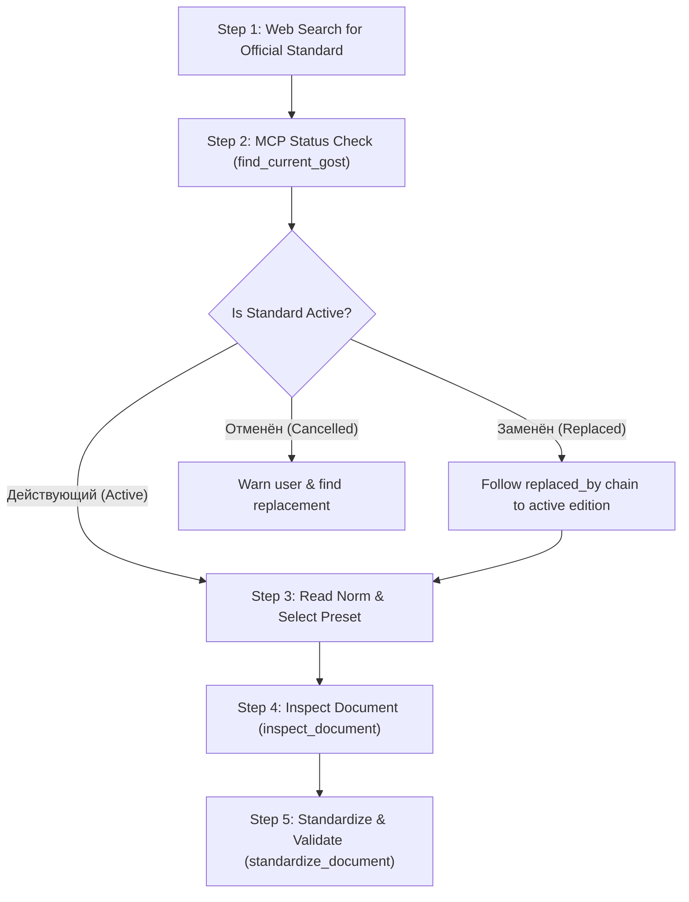

# GOST Standardizer & Normative Verification Skill

This skill guides agents in inspecting, validating, and formatting Russian Word documents (`.docx`, `.docm`, `.doc`) according to official GOST standards, and verifying standard numbers and legal statuses using the Meganorm catalog MCP server.

---

## ⚠️ CRITICAL RULE: Zero Hallucination of Standards

> [!CAUTION]
> **NEVER guess, invent, or hallucinate GOST numbers or revision years from memory.**
> LLMs frequently hallucinate incorrect standard numbers, obsolete revision years (e.g. citing `ГОСТ Р 7.0.97-2016` instead of the active `ГОСТ Р 7.0.97-2025`), or nonexistent designations.
> **You MUST follow the 5-step workflow below without skipping verification.**

---

## The 5-Step Workflow



### Step 1: Web Verification First (No Guessing)
Before doing any standardization or referencing any standard:
1. If the user asks to format a document according to a standard (e.g. "отчет о НИР", "деловое письмо", "техническое задание"):
   - Perform a web search (e.g. `search_web: "отчет о нир гост действующий"`) to find the official, authentic designation and year of introduction.
2. Confirm the exact designation (e.g. `ГОСТ 7.32-2017`, `ГОСТ Р 7.0.97-2025`, `ГОСТ 2.105-2019`).

### Step 2: Meganorm MCP Status Verification
Call the MCP tool `find_current_gost`:
```json
{
  "query": "7.0.97-2025"
}
```
Examine the returned `status_summary`:
- **`status: "действующий"`**: Document is in force. You may proceed.
- **`status: "заменён"`**: Document has been superseded! Check `primary_document.replaced_by` and `active_replacement`. Inform the user and use the replacing active standard.
- **`status: "отменён"`**: Document was cancelled without a direct replacement. Warn the user immediately.

### Step 3: Read Norm Text & HTML-to-Markdown
When you need to read the specific clauses, formatting rules, or tables from an official norm page or website:
- Use the MCP tool `convert_html_to_markdown` or `fetch_norm_markdown`:
  ```json
  {
    "html": "<table>...</table>"
  }
  ```
- This parses the normative text into clean GitHub-flavored Markdown without HTML noise.

### Step 4: Preset Mapping

Choose the appropriate preset based on document type:

| Preset Key | Standard | Typical Uses | Margins (L / R / T / B) | Font & Size | Spacing & Indent |
| :--- | :--- | :--- | :--- | :--- | :--- |
| **`report`** | **ГОСТ 7.32-2017** | Отчеты о НИР, курсовые, дипломные, пояснительные записки | 30 / 10 / 20 / 20 мм | Times New Roman 14 pt | 1.5 строки, отступ 12.5 мм |
| **`office`** | **ГОСТ Р 7.0.97-2025** | Приказы, распоряжения, деловые письма, регламенты | 20 / 10 / 20 / 20 мм | Times New Roman 14 pt / 12 pt | 1.0 строка, отступ 0 или 12.5 мм |
| **`technical`** | **ГОСТ 2.105-2019** | Технические задания (ТЗ), спецификации, тех. условия | 30 / 10 / 20 / 20 мм | Times New Roman 14 pt | 1.5 строки, отступ 12.5 мм |
| **`legacy-college`** | Ведомственные правила | Учебные образцы с нестандартными полями | 28 / 6 / 18 / 19 мм | Times New Roman 14 pt | 1.5 строки, отступ 12.5 мм |

### Step 5: Inspect, Standardize, and Verify

1. **Inspect First (Non-destructive)**:
   ```json
   {
     "name": "inspect_document",
     "arguments": {
       "path": "/path/to/document.docx",
       "sample_size": 8
     }
   }
   ```
   Check `preset_guess`, `issues`, and font discrepancies.

2. **Standardize (Creates Clean New Document)**:
   ```json
   {
     "name": "standardize_document",
     "arguments": {
       "path": "/path/to/document.docx",
       "preset": "report",
       "output_path": "/path/to/document_gost.docx",
       "overwrite": true,
       "aggressive": false
     }
   }
   ```
   - Automatically cleans XML theme attributes (`w:asciiTheme`) so Word doesn't override with Calibri/Aptos.
   - Cleans and aligns tables according to GOST (12 pt, single spacing).
   - Standardizes headings, lists, margins, and line spacing.

3. **Validate Result**:
   ```json
   {
     "name": "validate_document",
     "arguments": {
       "path": "/path/to/document_gost.docx",
       "preset": "report"
     }
   }
   ```
   Confirm that all issues are resolved (`summary.errors == 0`).

---

## MCP Tools Reference

- `find_current_gost`: Check document existence, active status, date of introduction, and replacement chains.
- `search_meganorm_catalog`: Search Meganorm by keywords or standard numbers.
- `get_meganorm_topics`: List normative categories.
- `convert_html_to_markdown`: Fast HTML to Markdown converter (native Rust abi3 engine with fallback).
- `fetch_norm_markdown`: Fetch normative card/text directly from Meganorm into Markdown.
- `inspect_document`: Inspect formatting deviations without changing file.
- `validate_document`: Validate formatting against standard preset.
- `standardize_document`: Format document into GOST-compliant DOCX.
- `compare_to_preset`: Side-by-side comparison of document metrics vs preset.
- `explain_preset`: Detailed explanation of preset parameters or file fit.
- `list_presets` / `list_profiles`: List available built-in presets and saved profiles.
- `load_profile` / `save_profile`: Load or save custom institutional formatting profiles.
